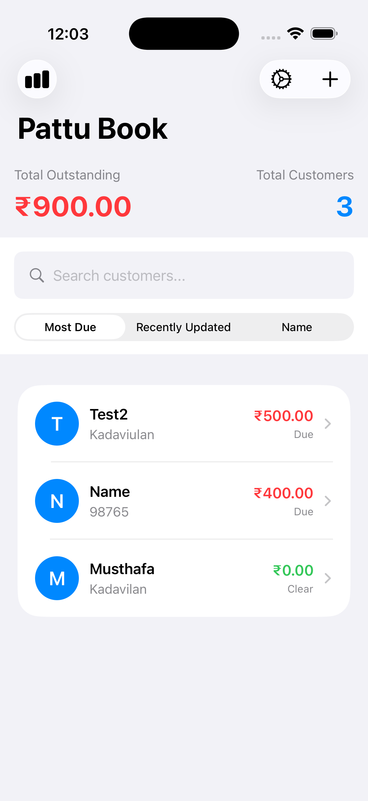

# 📒 Pattu Book – Credit Management App

[](https://developer.apple.com/ios/)
[](https://swift.org)
[](LICENSE)

An iOS application built with **SwiftUI, MVVM, and Core Data** to help small retail shop owners manage customer credits (*kudivayppa*) easily and neatly.

> **Perfect for** grocery stores, small businesses, and local shops that offer credit to customers.

---

## 📱 Features

### 👥 Customer Management
- Add and edit customers with ease
- Store name, phone number, and additional details
- Smart sorting options:
  - **Most Due** – Prioritize customers with highest outstanding balance
  - **Recently Updated** – See latest interactions first
  - **Name** – Alphabetical organization

### 💸 Transaction Tracking
- Add **Credit** (money owed) and **Payment** (money received) entries
- Auto-calculated outstanding balance per customer
- Color-coded visual indicators:
  - 🔴 **Red** = Customer has outstanding dues
  - 🟢 **Green** = Balance cleared

### 🧾 Customer Statement (PDF)
- Generate professional PDF statements for individual customers
- Includes complete transaction history with dates and notes
- Built-in **Share Sheet** for WhatsApp, Email, etc.
- Direct **AirPrint** support for instant printing

### 📊 Reports Dashboard
Get real-time financial insights with customizable time periods:
- **Today**
- **This Week**
- **This Month**

Track key metrics:
- Total Credits Given
- Total Payments Received
- Net Cash Flow Change

### ⚙️ Settings
- **PIN Lock** – Optional security layer to protect sensitive data
- **Language Support** – Switch between English & Malayalam (മലയാളം)
- Version information and app details

---

## 🛠️ Tech Stack

| Technology | Purpose |
|------------|---------|
| **SwiftUI** | Modern declarative UI framework |
| **MVVM** | Clean architecture with separation of concerns |
| **Core Data** | Persistent local storage |
| **PDFKit** | Statement generation and preview |
| **LocalAuthentication** | Biometric and PIN security |

---

## 📋 Requirements

- **iOS 15.0+**
- **Xcode 14.0+**
- **Swift 5.7+**

---

## 🔧 Installation

### Clone the repository

```bash
git clone https://github.com/musthafalabeebka/PattuBook.git
```

### Open in Xcode

```bash
cd PattuBook
open PattuBook.xcodeproj
```

### Build and Run

1. Select your target device or simulator
2. Press `Cmd + R` or click the Play button
3. The app will launch with sample data (if configured)

> **Note:** No external dependencies required. All frameworks are native iOS.

---

## 📸 Screenshots

<table>
  <tr>
    <td></td>
    <td></td>
    <td></td>
    <td></td>
  </tr>
  <tr>
    <td align="center">Customer List</td>
    <td align="center">Customer Details</td>
    <td align="center">Add Transaction</td>
    <td align="center">Reports</td>
  </tr>
</table>

---

## 📁 Project Structure

```
PattuBook/
├── Views/            # SwiftUI views and components
├── ViewModels/       # MVVM view models
├── Management/       # Helper functions, extensions, PDF generation, data persistence
├── Localization/     # Assets, localization files
└── PattuBook.xcdatamodeld  # Core Data schema
```

---

## 🚀 Roadmap

- [ ] **iCloud Sync** – Access data across multiple devices
- [ ] **Dark Mode** – Better viewing in low-light conditions
- [ ] **Export to Excel** – Generate CSV/XLSX reports
- [ ] **Multi-Shop Support** – Manage multiple businesses in one app
- [ ] **Data Backup & Restore** – Secure cloud backup options
- [ ] **Custom Themes** – Personalize app appearance
- [ ] **Expense Tracking** – Track shop expenses alongside credits
- [ ] **WhatsApp Integration** – Send statements directly via WhatsApp

---

## 🤝 Contributing

Contributions are welcome! Here's how you can help:

1. **Fork** the repository
2. **Create** a feature branch (`git checkout -b feature/AmazingFeature`)
3. **Commit** your changes (`git commit -m 'Add some AmazingFeature'`)
4. **Push** to the branch (`git push origin feature/AmazingFeature`)
5. **Open** a Pull Request

To report bugs or suggest improvements, please [open an issue](https://github.com/musthafalabeebka/PattuBook/issues).

---

## 📄 License

This project is licensed under the **MIT License** – see the [LICENSE](LICENSE) file for details.

---

## 👤 Author

**Musthafa Labeeb**  
iOS Developer – SwiftUI Specialist

- GitHub: [@musthafalabeebka](https://github.com/musthafalabeebka)
- Email: musthafalabeebka@gmail.com
- LinkedIn: [Musthafa Labeeb K A](https://linkedin.com/in/musthafalabeebka)

---

## 💡 Inspiration

Built with ❤️ for small business owners in Kerala who need a simple, reliable way to track customer credits without complex accounting software.

---

## ⭐ Show Your Support

If this project helped you, give it a ⭐️ on GitHub!

---

**Made in Kerala 🌴 | കേരളത്തിൽ നിർമ്മിച്ചത്**
